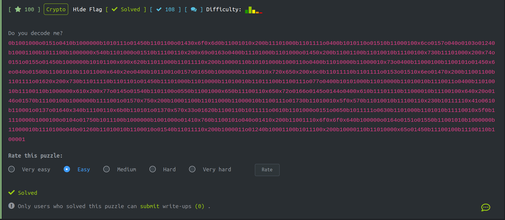
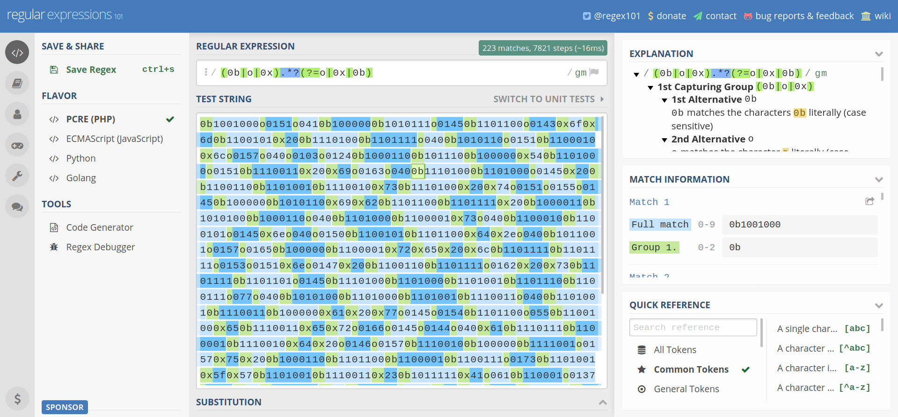
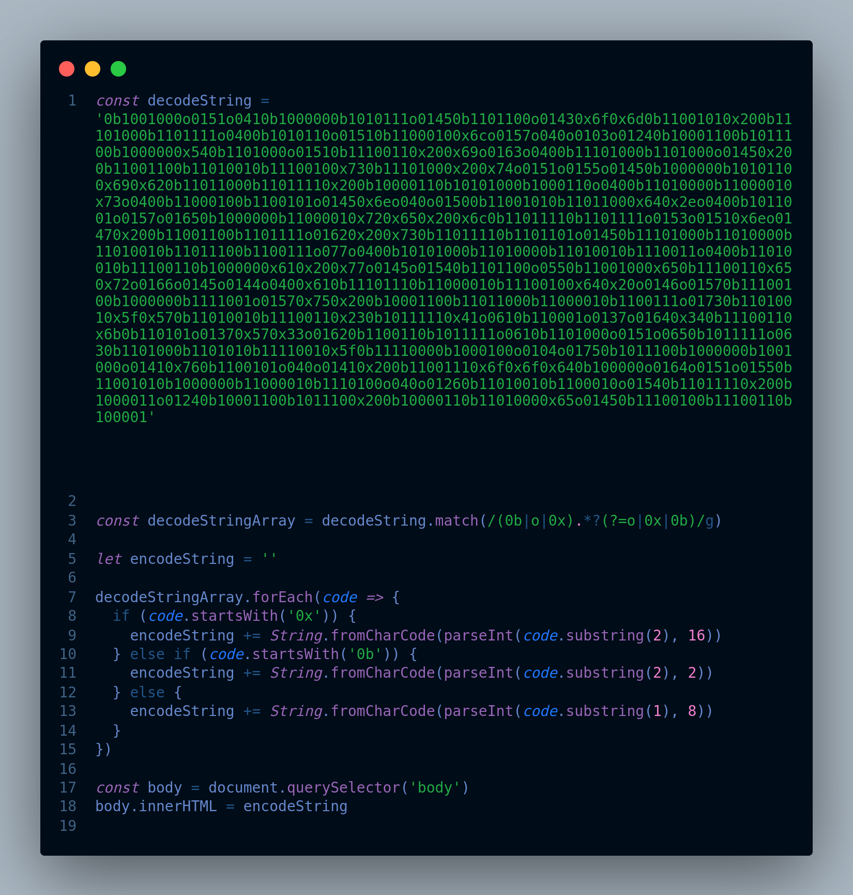
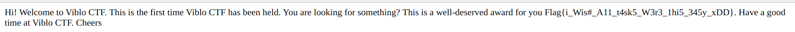

# Problem



# Overview

Challenge này cho các bạn một chuỗi và nhiệm vụ của các bạn là decode chuỗi này để được flag.

```
    0b1001000o0151o0410b1000000b1010111o01450b1101100o01430x6f0x6d0b11001010x200b11101000b1101111o0400b1010110o01510b11000100x6co0157o040o0103o01240b10001100b1011100b1000000x540b1101000o01510b11100110x200x69o0163o0400b11101000b1101000o01450x200b11001100b11010010b11100100x730b11101000x200x74o0151o0155o01450b1000000b10101100x690x620b11011000b11011110x200b10000110b10101000b1000110o0400b11010000b11000010x73o0400b11000100b1100101o01450x6eo040o01500b11001010b11011000x640x2eo0400b1011001o0157o01650b1000000b11000010x720x650x200x6c0b11011110b1101111o0153o01510x6eo01470x200b11001100b1101111o01620x200x730b11011110b1101101o01450b11101000b11010000b11010010b11011100b1100111o077o0400b10101000b11010000b11010010b1110011o0400b11010010b11100110b1000000x610x200x77o0145o01540b1101100o0550b11001000x650b11100110x650x72o0166o0145o0144o0400x610b11101110b11000010b11100100x640x20o0146o01570b11100100b1000000b1111001o01570x750x200b10001100b11011000b11000010b1100111o01730b11010010x5f0x570b11010010b11100110x230b10111110x41o0610b110001o0137o01640x340b11100110x6b0b110101o01370x570x33o01620b1100110b1011111o0610b1101000o0151o0650b1011111o0630b1101000b1101010b11110010x5f0b11110000b1000100o0104o01750b1011100b1000000b1001000o01410x760b1100101o040o01410x200b11001110x6f0x6f0x640b100000o0164o0151o01550b11001010b1000000b11000010b1110100o040o01260b11010010b1100010o01540b11011110x200b1000011o01240b10001100b1011100x200b10000110b11010000x65o01450b11100100b11100110b100001
```

Nhìn lướt qua chuỗi ở trên ta có thể thấy các dãy kí tự có dấu hiệu lặp lại như sau:
```
    0b1001000o0151o0410b1000000b1010111o01450b1101100o01430x6f0x6d0b1100101
```
Mình sẽ tách các chuỗi này ra line by line cho dễ nhìn
```
    0b1001000
    o0151
    o041
    0b100000
    0b1010111
    o0145
    0b1101100
    o0143
    0x6f
    0x6d
    0b1100101
```

Như các bạn thấy ta có 3 loại chuỗi được lặp đi lặp lại và chúng bắt đầu bằng các kí tự.

```
    - 0b chuỗi binary
    - 0x chuỗi hex
    - o  chuỗi octal
```

Để lấy được flag thì nhiệm vụ của các bạn phải tách ra từ chuỗi gốc và decode từng chuỗi con một. Vậy làm cách nào để tự động hóa nó bằng code. Sau đây mình sẽ thực hiện lại quá trình mình lấy flag.

# Solve The Problem

1. Việc đầu tiên chúng ta cần làm là tách từ chuỗi cha ra thành những chuỗi con dưới dạng Binary, Hexa và Octal.

    - Đầu tiên mình sử dụng tool [Regex101](https://regex101.com/) để tiến hành match chuỗi
    
    - Chuỗi Regex: 
    ```
        (0b|o|0x).*?(?=o|0x|0b)
    ```
2. Tiếp theo là hiện thực code. Ở đây mình dùng JavaScript để code.
    
3. Kết quả
     
     - Tới đây rồi thì lấy flag rồi submit thôi
     - Flag{i_Wis#_A11_t4sk5_W3r3_1hi5_345y_xDD}