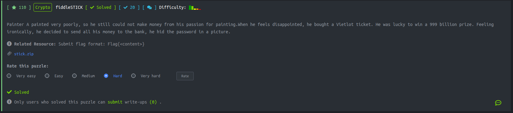
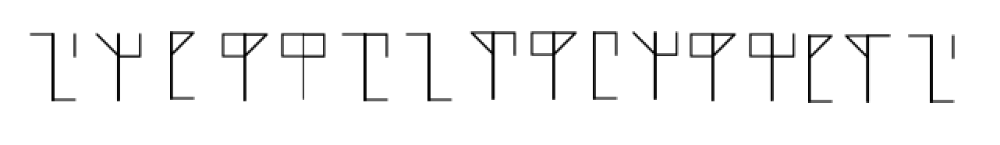

# Problem



# Overview



Nhìn vào tấm ảnh thì đương nhiên việc cần làm là phải tìm key rồi.

# Solve The Problem

Đầu tiên mình vào google và search trực tiếp bằng tấm ảnh nhưng nó không có bất kì clue nào cả.

Sau đó tiếp tục lang thang trên google với các từ khóa "stick language", "top symbol language", "square triangle language", bla bla bla thì thấy được tấm ảnh này


Well tới đây thì chắc là sắp có flag rồi. Dựa theo qui luật của tấm ảnh thì ta decode tấm hình trên thành dãy số sau.

```
    116 48 105 95 99 117 110 57 95 107 48 95 98 105 51 116
```

Được chuỗi thập phân này thì mình mang nó  convert sang asiic xem sao và bùm flag đây rồi.

```
    t0i_cun9_k0_bi3t
```

# Flag

Gắn chuỗi trên vào format và get point thôi nào.

```
    Flag{t0i_cun9_k0_bi3t}
```
