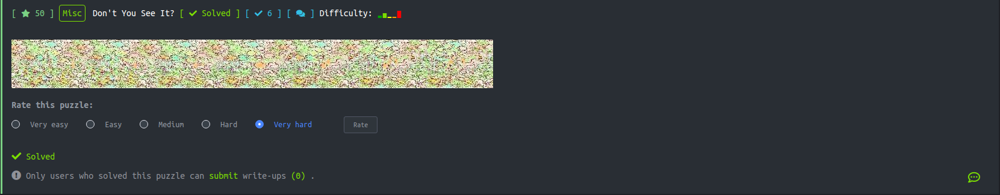
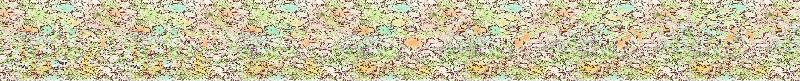
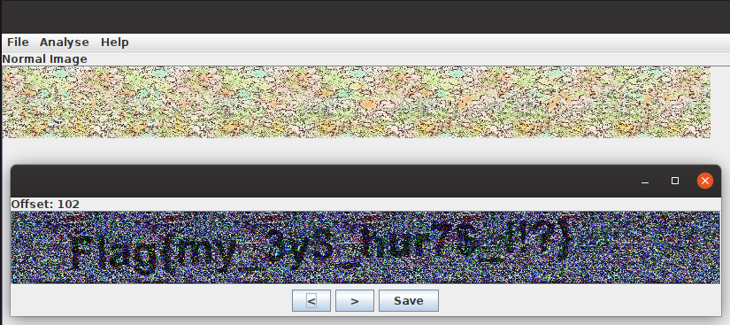

# Problem



# Overview



Bài misc này là một tấm ảnh có nhiều pixel màu khác nhau nên mình nghĩ Flag được giấu sau đống pixel này.

# Solve The Problem

Mặc dù nghĩ Flag được giấu sau đống pixel nhưng mình vẫn đi kiểm tra content của file bằng lệnh ``` strings ``` vì bài này ở rank E biết đâu Flag chỉ giấu trong content của ảnh. 

Dạo một dòng thì không thấy có gì đặc biệt cả mình bắt đầu chuyển sang sài tool [stegsolve](https://github.com/eugenekolo/sec-tools/tree/master/stego/stegsolve/stegsolve). Thử tấm ảnh với nhiều plane màu khác nhau nhưng cũng chưa có Flag. Rồi mình mới nghĩ có khi nào tấm ảnh được combine bởi 2 tấm ảnh giống nhau nhưng dời offset để ẩn Flag. Sau đó mình thử sài chức năng ```Stereogram Solver``` trong menu ```Analyse``` để dời offset thử thì Flag dần dần hiện ra.



Khi mà dời offset đến 102 thì Flag hiện ra như hình trên. Nếu thấy Flag không rõ các bạn có thể save lại tấm ảnh và đổi plane màu để thấy flag rõ hơn.

# Flag

```
    Flag{my_3y3_hur7$_!!?}
```
