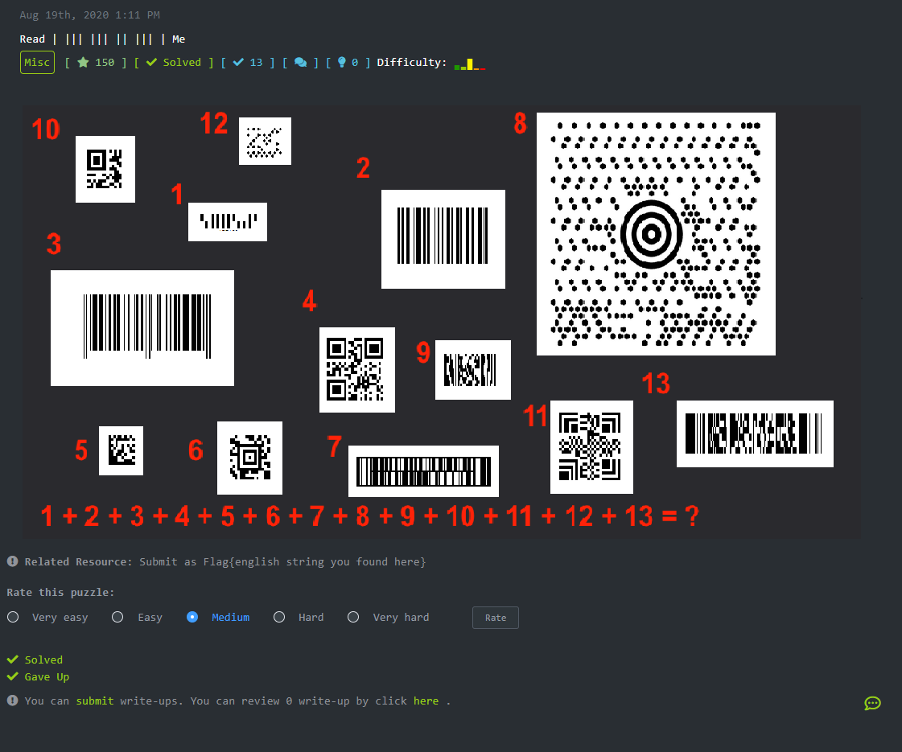
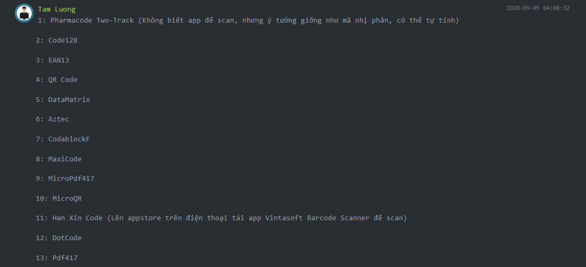
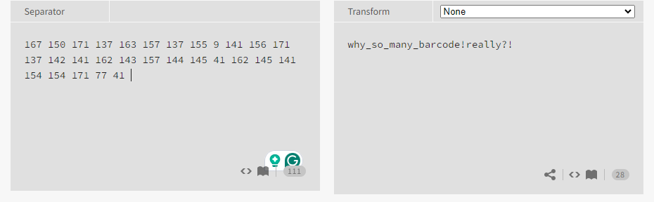

# Problem



# Overview


Bài misc này tương đối khó đối vời mình vì có đến 13 loại code và nhiều loại trong này tại thời điểm giải bài mình chưa biết đến. Nhiệm vụ là phải decode được các mã code này và theo như hint từ tác giả thì cộng tất cả các mã đã decode được lại thành một. Sau khi mình gave up thì có được hint như sau.



# Solve The Problem

Có hint rồi thì mình sử dụng các trang https://online-barcode-reader.com/ https://products.aspose.app/barcode/recognize/ https://zxing.org/w/decode.jspx https://www.dynamsoft.com/barcode-reader/barcode-types/ để decode. Đối với Pharmacode Two-Track công thức tính như sau


PharmacodeTwo-TrackNumber = n<sup>th</sup>bit x 3<sup>n-1</sup>

Giá trị của bit sẽ có 3 trường hợp. Cạnh ngắn dưới tương ứng giá trị 1, cạnh ngắn trên giá trị 2 và cạnh dài giá trị 3. Trong trường hợp này cách tính code số 1 của problem sẽ là:

2 x 3<sup>10</sup> + 1 x 3<sup>9</sup> + 3 x 3<sup>8</sup> +3 x 3<sup>7</sup> + 3 x 3<sup>6</sup> + 3 x 3<sup>5</sup> + 2 x 3<sup>4</sup> + 1 x 3<sup>3</sup> + 1 x 3<sup>2</sup> + 3 x 3<sup>1</sup> + 2 x 3<sup>0</sup> 

Giá trị của tất cả các code sau khi đã quét sẽ là:

1. 167150
2. 171137
3. 1631571371559
4. 141156
5. 171137
6. 142141
7. 162143
8. 157144
9. 14541
10. 162145
11. 141154
12. 154171
13. 7741

Cộng tất cả lại với nhau ta sẽ được 1671501711371631571371559141156171137142141162143157144145411621451411541541717741. Thấy rằng với mỗi một cặp 3 kí tự đều bắt đầu bằng 1, có khả năng sẽ chuyển đổi chuỗi trên từ hệ oct sang text. Và ta có flag như sau:




# Flag

```
    Flag{why_so_many_barcode!really?!}
```