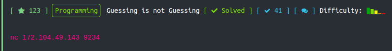
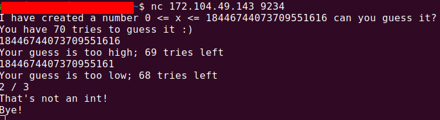
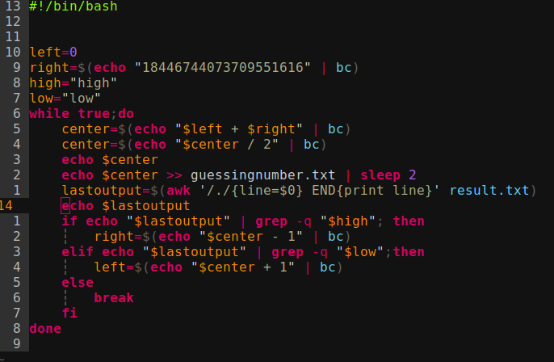
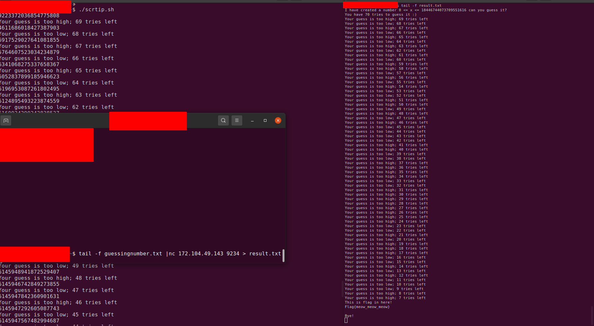

# Problem



# Overview

Nhìn đề bài xong thì mình bật Terminal gõ dòng lệnh trong đề  rồi ngồi đợi server response.



Như trong hình trên thì bạn phải đoán được number mà server cho trong range 0 => 18446744073709551616 và bạn có 70 lần để đoán. Mình có nhập một vài trường hợp ```string```, ```decimal```, ```math operator``` thì đều bị invalid input. Input chỉ chấp nhận ```integer```. Tìm số trong một khoảng thì bài này chỉ cần áp dụng giải thuật binary search. Nhưng trong quá trình tìm Flag thì mình có gặp một số vấn đề sau:
1. Viết giải thuật binary search bằng shell script
2. Cách pipe input đến stdin khi connect được tới server. Vì khi chạy giải thuật ta cần đưa con số ta đoán vào stdin mà server đang đợi và nếu chạy thủ công giải thuật xong nhập từng con số vào thì rất là dummy
3. Cách pipe output từ server trả về khi ta đoán số để đoạn script giới hạn left right trong quá trình chạy giải thuật 


# Solve The Problem

1. Để giải quyết được vần đề này thì mình bỏ một ít thời gian đọc syntax cở bản. Cái này thì đơn giản
2. Mình có dạo tìm xem các solution thì mình quyết định sử dụng cách này:
    - Khi guessing number thì ta sẽ viết con số đó ra file ```guessingnumber.txt```
    - Sau đó sử dụng lệnh ```tail -f guessingnumber.txt``` pipe vào lệnh ```nc 172.104.49.143 924```
    ```
        tail -f guessingnumber.txt | nc 172.104.49.143 924
    ```
3. Response trả về từ server ta sẽ pipe nó ra file ```result.txt```. Và mỗi lần đoán số mới ta sẽ lấy dòng cuối cùng của file để giới hạn left right.

Toàn bộ câu lệnh sẽ như sau:

```
    tail -f guessingnumber.txt | nc 172.104.49.143 924 > result.txt
```
Ok các vần đề gặp phải đã được giải quyết. Bây giờ tiến hành viết script thôi.



Trong quá trình quyết script thì lại phát sinh thêm vấn đề nữa: 
1. Việc tính toán với bigInt thì mình có tìm được giải pháp là lệnh ```bc```. 
2. Việc pipe output từ server đến file ```result.txt``` khá chậm làm cho việc đọc line cuối của file bị sai lệch do đó mình thêm lệnh ```sleep 2``` đợi 2s cho việc pipe output hoàn thành.

Ở line thứ 13 các bạn có thể thử dùng lệnh ```tail -1 result.txt``` để lấy được line cuối cùng của file. Ở đây mình sử dụng như trong hình :)))
# Result


# Flag

```
    Flag{meow_meow_meow}
```
