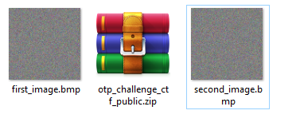
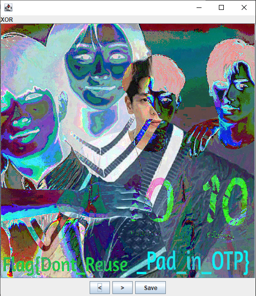

# Problem


# Overview

Giải nén filezip ta có được 2 file ảnh first_image.bmp và second_image.bmp.

 
# Solve The Problem

Sử dụng tool [stegsolve](https://github.com/eugenekolo/sec-tools/tree/master/stego/stegsolve/stegsolve). Combine 2 ảnh ta có kết quả




# Flag

```
    Flag{Dont_Reuse_Pad_in_OTP}
```