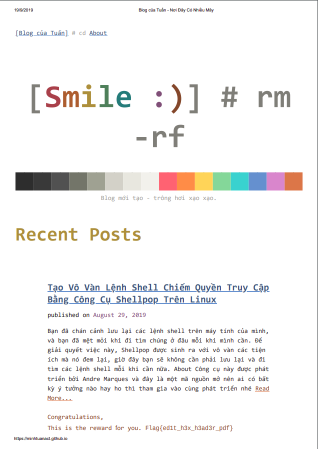

# Problem


# Overview

Download và giải nén file ```Blog.zip``` được một file pdf bị lỗi tên là ```Blog cua Tuan#1.pdf```. Để lấy được Flag thì ta phải fix file pdf này

# Solve The Problem

Mình quăng file này lên cho một tool fix pdf online thì nhân được file repaired sau:



De có Flag rồi tiếp theo là submit thôi easy peasy ~~
# Flag

```
    Flag{ed1t_h3x_h3ad3r_pdf}
```
