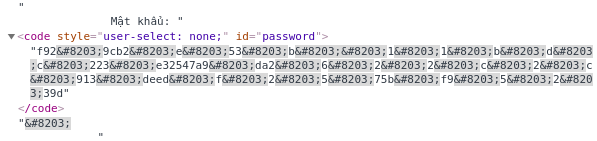

# Problem


# Overview

Nhìn vào link trong đề bài ta dễ dàng đoán được bài này có nhiều level. Đi được đến level cuối cùng thì ta sẽ có được Flag.

# Solve The Problem

1. http://172.104.49.143:4567/level1/:
    - Màn hình khi vào link của đề bài
        
    - Well cho form cho cả password copy hoặc gõ password vào thôi
    - Kết quả khi nhập password ```SUN$HELL```
        
2. http://172.104.49.143:4567/let_go_deeper/
    - Màn hình của level tiếp theo
        
    - Well lần này không cho password nữa view source bằng shortcut ```ctr + u ``` nào
        
    - Đọc sơ qua hàm trên ta có thể thấy nếu bỏ đi ```class="hidden"``` thì mật khẩu sẽ xuất hiện không nhất thiết phải không còn trực tuyến nữa nhé
    - Sau khi xóa ```class="hidden"``` tron phần inspect elemt của dev tool thì mật khẩu xuất hiện nè
        
    - De copy password và check thôi nào. Ố ồ sai password mất tiêu rồi.
    - Well level này làm khó nhau nhỉ. Được rồi convert password từ base64 sang asiic nào. Các bạn có thể dùng tool online hoặc sử dụng lib base6 của python.
    - Kết quả khi convert password trên sẽ là ```be_professional```
    - Lần này hy vọng sẽ check được với password trên
        
    - De có Flag rồi get point thôi nào.
    - Ố ồ không chấp nhận submit rõ ràng Flag rồi mà, quay lại kiểm tra lại nào.
        
    - -_- Chưa phải là level cuối mà đưa fake flag lừa người
3. http://172.104.49.143:4567/is_this_the_end/
    - Màn hình của final level
        
    - Well lại cho password giống level1. Nhưng lại chặn không cho copy.
    - View source và copy vậy. Có cái password cũng không cho copy.
            
    - Lấy pass rồi đem check thôi nào ```f92​9cb2​e​53​b​​1​1​b​d​c​223​e32547a9​da2​6​2​2​c​2​c​913​deed​f​2​5​75b​f9​5​2​39d``` (This is fake password).
    - Sau khi check mình nhận được dòng chữ đỏ lè ```Error! Wrong password```. Mình thử đem convert từ hex sang asiic nhưng không có kết quả gì cả. Nhìn lại title ```I trust what I see``` không lẽ cái mình thấy lại không phải là cái mình thấy. Nên lần này mình inspect trực tiếp element.
        
    - Và đúng là không thể tin bố con thằng nào được. Như các bạn thấy trong password có chèn thêm những chuỗi giống nhau ```&#8203;```. Đây là các mã HTML Symbol, trình duyệt sẽ tự động encode các chuỗi này thành các kí hiệu, biểu tượng. Ví dụ ```&#38;``` được trình duyệt encode thành kí tự ```&```. Nếu các bạn gõ ```&#38;``` trên thanh nhập url của google chrome kết quả tìm kiếm sẽ tự động chuyển sang từ khóa ```&```. Tương tự với HTML Symbol trong password trên. Đây là kí tự khoảng trống với độ dài bằng không ```(ZERO WIDTH SPACE)```. Trên thực tế password trên không phải là các kí tự ta thấy liền nhau mà giữa chúng có các khoảng trắng độ dài bằng không nên chúng ta nhìn thấy như là nó đang liền nhau.
    - Bỏ đi các HTML Symbol trong chuỗi password khi copy hoặc gõ lại từ bàn phím và submit thì ta sẽ có Flag. (True Password: ```f929cb2e53b11bdc223e32547a9da2622c2c913deedf2575bf95239d```)
        
    - Well lần này mới là Flag thật
# Flag

```
    Flag{only_trust_what_you_typed}
```
